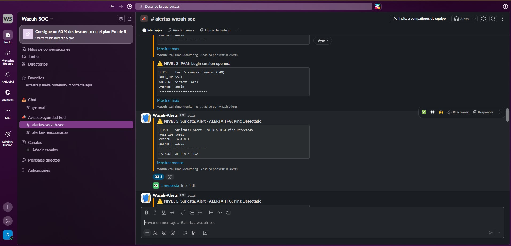
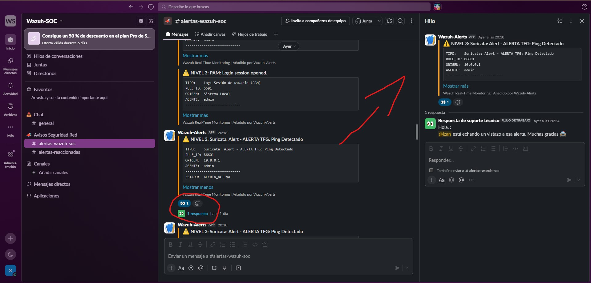
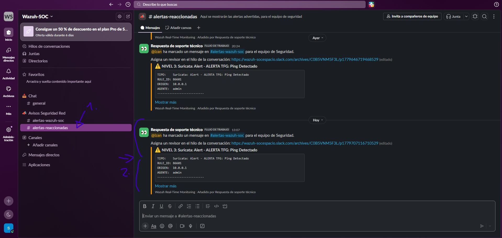

# 🚀 Demostración del Flujo de ChatOps

En esta sección se detalla el funcionamiento del sistema en un entorno real de monitorización de seguridad (SOC).

## 📥 1. Recepción de la Alerta
Cuando **Wazuh** detecta una anomalía, envía automáticamente una notificación al canal `#alertas-wazuh-soc`. 

> 
> *Nota: La alerta incluye nivel de severidad, descripción del evento e IP de origen.*

## 👁️ 2. Toma de Control (Ack)
El analista reacciona con el emoji `:eyes:` para indicar que está revisando el incidente. Esto dispara dos acciones inmediatas:

1. **Hilo de comunicación:** Se crea un hilo automático donde se confirma quién está atendiendo la alerta.
2. **Notificación de estado:** El equipo recibe la confirmación visual de que el incidente está bajo investigación.

> 

## 📊 3. Centralización en Canal de Auditoría
Paralelamente, el flujo redirige la información crítica al canal `#alertas-reaccionadas`. Esto permite:
*   Mantener un historial de incidentes gestionados.
*   Facilitar la supervisión por parte de los responsables del SOC sin saturar el canal de logs en bruto.

> 

---

## 📈 Beneficios del Sistema

*   **Optimización del Canal:** El 80% de la comunicación técnica se desplaza a los hilos, manteniendo el canal principal limpio para nuevas alertas.
*   **Responsabilidad y Trazabilidad:** Al quedar registrado el analista que interactúa con la alerta, se establece una responsabilidad clara sobre el incidente.
*   **Reducción de Latencia:** El flujo automatizado permite que la respuesta inicial y la notificación al equipo ocurran en cuestión de segundos.
