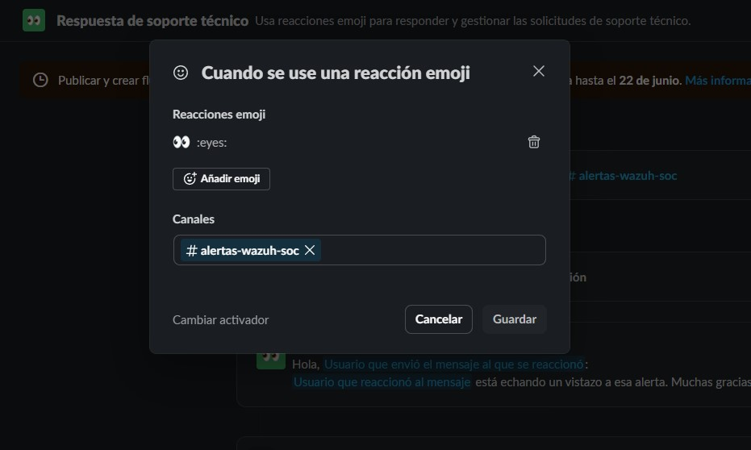
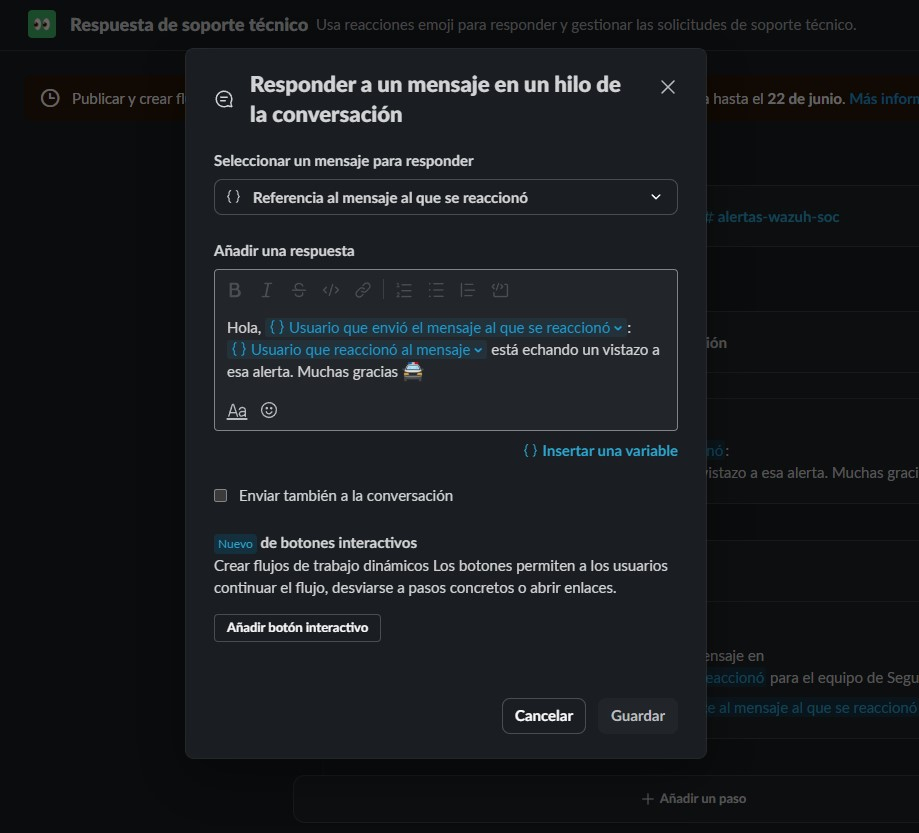
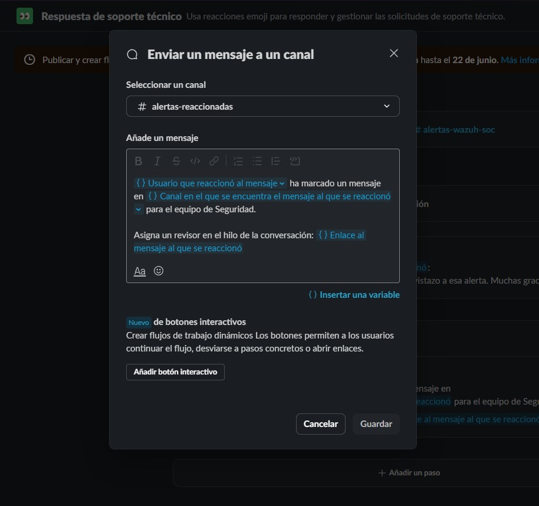

# 🤖 Slack ChatOps: Automatización de Respuesta ante Incidentes (SOC)

Este repositorio documenta la implementación de un flujo de trabajo automatizado en Slack para la gestión de alertas de seguridad. El sistema permite una respuesta rápida y organizada mediante el uso de disparadores gráficos y variables dinámicas.

## 🚀 Flujo de Trabajo (Workflow)

El flujo está diseñado para canalizar las alertas del SIEM (Wazuh) y permitir que los analistas tomen control de los incidentes sin saturar el canal principal.

### 1. Disparador de Acción
*   **Activador:** Reacción emoji `:eyes:`.
*   **Canal de monitoreo:** `#alertas-wazuh-soc`
*   **Función:** Inicia la cadena de respuesta automática al identificar que un analista ha visto la alerta.

### 2. Respuesta Automática en Hilo (Threads)
Para mantener la limpieza en el canal, la comunicación se traslada a un hilo:
*   **Mensaje:** `Hola, {{Usuario que envió el mensaje}}: {{Usuario que reaccionó}} está echando un vistazo a esa alerta. Muchas gracias 🚔`
*   **Objetivo:** Notificar al emisor y confirmar la asignación del incidente en tiempo real.

### 3. Registro y Control Centralizado
El flujo finaliza notificando a un canal de supervisión para auditoría:
*   **Canal de destino:** `#alertas-reaccionadas`
*   **Contenido:**
    > `{{Usuario que reaccionó}} ha marcado un mensaje en {{Canal de origen}} para el equipo de Seguridad.`
*   **Acceso directo:** Incluye un enlace dinámico al mensaje original para facilitar la revisión inmediata.

---

## 🛠️ Tecnologías Utilizadas
*   **Slack Workflow Builder:** Motor de automatización gráfica.
*   **Variables de Contexto:** Uso de datos dinámicos de usuario, canal y marca de tiempo.
*   **ChatOps:** Metodología de gestión de operaciones a través del chat.

---

## 📸 Guía de Configuración Visual
*(En esta sección se incluyen las capturas de pantalla de la interfaz de configuración)*

1. **Configuración del Activador:**

3. **Lógica de Respuesta:**

5. **Redirección de Alertas:**

